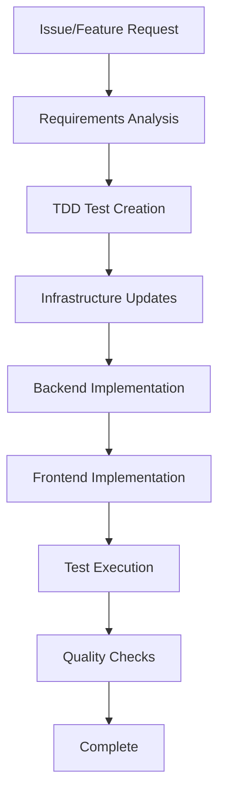

# Contributing to wezterm-parallel Projects

This guide helps contributors work effectively with wezterm-parallel projects. This starter kit provides templates and guidelines for multi-agent autonomous development systems.

## 🤖 For AI Agents

This section provides guidelines for AI agents (Claude, Cursor, etc.) to efficiently progress development in any project using this starter kit.

### 📋 Development Process Flow



### 🎯 Step-by-Step Implementation Guide

#### 1. Requirements Analysis (`docs/specs/`)
```bash
# File naming: F-XX-feature-name.md
# Example: F-05-user-authentication.md
```

**Required Sections:**
- Summary: Feature overview
- User Stories: User story format
- Technical Requirements: Services and dependencies
- API Specification: Backend API design
- Infrastructure Changes: Required infrastructure updates
- Acceptance Criteria: Testable acceptance criteria

#### 2. TDD Test Creation (`tests/`)
```typescript
// Example: Backend function testing
describe('User Authentication Handler', () => {
  const mockClient = mockClient(DatabaseClient);

  beforeEach(() => {
    mockClient.reset();
  });

  test('should authenticate valid user', async () => {
    // Arrange
    const event = createAPIEvent({
      body: JSON.stringify({ email: 'test@example.com', password: 'password' })
    });
    
    mockClient.on(QueryCommand).resolves({ Items: [validUser] });
    
    // Act
    const result = await handler(event);
    
    // Assert
    expect(result.statusCode).toBe(200);
    expect(JSON.parse(result.body)).toHaveProperty('token');
  });
});
```

#### 3. Infrastructure Updates (`infrastructure/lib/stacks/`)
```typescript
// Example: Infrastructure as Code updates
export class ApiStack extends Stack {
  constructor(scope: Construct, id: string, props: StackProps) {
    super(scope, id, props);

    // New service resource
    const newService = new Service(this, 'NewService', {
      // Service configuration based on project tech stack
      // Reference docs/tech-stack.md for technology choices
    });

    // API integration
    const apiResource = this.api.root.addResource('new-endpoint');
    apiResource.addMethod('POST', new Integration(newService));
  }
}
```

#### 4. Backend Implementation
```typescript
// Example: Generic backend service implementation
import { APIGatewayEvent, APIGatewayProxyResult } from 'aws-lambda';

export const handler = async (event: APIGatewayEvent): Promise<APIGatewayProxyResult> => {
  try {
    // Validate input
    const body = JSON.parse(event.body || '{}');
    
    // Business logic implementation
    const result = await processRequest(body);
    
    return {
      statusCode: 200,
      headers: {
        'Content-Type': 'application/json',
        'Access-Control-Allow-Origin': '*',
      },
      body: JSON.stringify(result)
    };
  } catch (error) {
    console.error('Handler error:', error);
    return {
      statusCode: 500,
      body: JSON.stringify({ error: 'Internal server error' })
    };
  }
};
```

#### 5. Frontend Implementation
```typescript
// Example: Frontend component implementation
import { useState } from 'react';
import { useAuth } from '../hooks/useAuth';

export const FeatureComponent: FC = () => {
  const { user, getToken } = useAuth();
  const [loading, setLoading] = useState(false);

  const handleAction = async () => {
    setLoading(true);
    try {
      const token = await getToken();
      const response = await fetch('/api/feature', {
        method: 'POST',
        headers: {
          'Authorization': `Bearer ${token}`,
          'Content-Type': 'application/json',
        },
        body: JSON.stringify({ data: 'example' })
      });
      
      const result = await response.json();
      // Handle success
    } catch (error) {
      console.error('Feature error:', error);
    } finally {
      setLoading(false);
    }
  };

  return (
    <button onClick={handleAction} disabled={loading}>
      {loading ? 'Processing...' : 'Execute Action'}
    </button>
  );
};
```

### 🛠️ Code Quality Checklist

Before completing implementation, verify:

- [ ] TypeScript compilation succeeds (`npm run build`)
- [ ] All tests pass (`npm test`)
- [ ] Infrastructure tests pass (`npm run test:infrastructure`)
- [ ] Linting passes (`npm run lint`)
- [ ] Infrastructure changes reviewed (`npm run infra:diff`)
- [ ] Security configurations validated
- [ ] Performance requirements met
- [ ] Documentation updated

### 📁 File Path Templates

Standard file paths for new features:

```
docs/specs/F-XX-feature-name.md                    # Specification
infrastructure/lib/stacks/feature-stack.ts         # Infrastructure (if needed)
packages/backend/src/functions/feature/            # Backend Functions
packages/backend/src/shared/feature/               # Shared utilities
packages/frontend/src/components/feature/          # Frontend Components
packages/frontend/src/pages/api/feature/           # API Routes
tests/backend/feature/                              # Backend tests
tests/frontend/feature/                             # Frontend tests
tests/infrastructure/feature-stack.test.ts         # Infrastructure tests
```

Refer to [docs/ARCHITECTURE.md](docs/ARCHITECTURE.md) for detailed module organization.

### 🚨 Common Pitfalls for AI Agents

**Avoid these implementation patterns:**

1. **Hardcoded Configuration**
   ```typescript
   // ❌ Bad - Hardcoded values
   const config = {
     apiUrl: 'https://api.example.com',
     secretKey: 'hardcoded-secret',
   };
   
   // ✅ Good - Environment variables
   const config = {
     apiUrl: process.env.API_URL,
     secretKey: process.env.SECRET_KEY,
   };
   ```

2. **Inefficient Resource Usage**
   ```typescript
   // ❌ Bad - Creating new connections
   export const handler = async (event) => {
     const client = new DatabaseClient({});
     // ...
   };
   
   // ✅ Good - Reuse connections
   const client = new DatabaseClient({});
   export const handler = async (event) => {
     // Use shared client
   };
   ```

3. **Missing Error Handling**
   ```typescript
   // ❌ Bad - No error handling
   const result = await externalService.call(data);
   
   // ✅ Good - Proper error handling
   try {
     const result = await externalService.call(data);
     return result;
   } catch (error) {
     console.error('Service call failed:', error);
     throw new ServiceError('External service unavailable');
   }
   ```

4. **Security Vulnerabilities**
   ```typescript
   // ❌ Bad - SQL injection risk
   const query = `SELECT * FROM users WHERE id = ${userId}`;
   
   // ✅ Good - Parameterized queries
   const query = 'SELECT * FROM users WHERE id = ?';
   const result = await db.query(query, [userId]);
   ```

### 🔄 Testing Strategy

#### Unit Testing
```bash
npm run test:unit              # Unit tests
npm run test:unit:watch        # Watch mode
npm run test:unit:coverage     # Coverage report
```

#### Infrastructure Testing
```bash
npm run test:infrastructure    # Infrastructure tests
npm run infra:diff             # Show infrastructure changes
npm run infra:validate         # Validate infrastructure code
```

#### Integration Testing
```bash
npm run test:integration       # API integration tests
npm run test:e2e              # End-to-end tests
```

#### Local Testing
```bash
npm run dev:local              # Local development environment
npm run test:local             # Local testing
```

### 📚 Reference Documentation

- [Product Requirements](docs/prd.md)
- [System Architecture](docs/ARCHITECTURE.md)
- [Technology Stack](docs/tech-stack.md)
- [Implementation Plan](docs/implementation-plan.md)
- [Architecture Decision Records](decisions/)

## 👥 For Human Contributors

### Prerequisites
- Node.js 18+
- npm/yarn/pnpm
- Git
- Project-specific tools (see [docs/setup-guide.md](docs/setup-guide.md))

### Project Setup
```bash
git clone https://github.com/your-username/your-project.git
cd your-project
npm install

# Install dependencies for all packages
npm run install:all

# Build the project
npm run build
```

### Development Workflow

#### 1. Infrastructure Development
```bash
cd infrastructure
npm run build                # Compile
npm run test                 # Run tests
npm run diff                 # Preview changes
npm run deploy               # Deploy
```

#### 2. Backend Development
```bash
cd packages/backend
npm run build                # Compile
npm run test                 # Run unit tests
npm run test:integration     # Integration tests
```

#### 3. Frontend Development
```bash
cd packages/frontend
npm run dev                  # Start development server
npm run build                # Production build
npm run test                 # Run tests
```

### Environment Management

#### Development Environment
```bash
npm run deploy:dev           # Deploy to development
npm run test:dev             # Test against dev environment
```

#### Staging Environment
```bash
npm run deploy:staging       # Deploy to staging
npm run test:staging         # Staging tests
```

#### Production Environment
```bash
npm run deploy:prod          # Production deployment
npm run test:prod            # Production smoke tests
```

### Git Workflow
1. Create feature branch from main
2. Follow specification → test → infrastructure → implementation flow
3. Verify all tests pass
4. Create Pull Request with proper documentation

## 📝 Documentation Standards

### Commit Messages
```
feat(api): Add user authentication endpoint
fix(frontend): Resolve login form validation
infra(stack): Add database connection pooling
test: Add integration tests for user service
docs: Update architecture documentation
```

### Pull Request Guidelines
- Reference related issue numbers
- Include implementation summary
- Document infrastructure changes and cost impact
- Ensure all tests pass
- Request appropriate reviewers

## 🔐 Security Guidelines

### Authentication & Authorization
- Implement proper token validation
- Use least privilege principle
- Secure API endpoints appropriately

### Data Protection
- Encrypt sensitive data at rest and in transit
- Implement proper input validation
- Use parameterized queries to prevent injection

### Infrastructure Security
```typescript
// Environment variable validation
const validateEnvironment = () => {
  const required = ['DATABASE_URL', 'API_KEY', 'SECRET_KEY'];
  for (const env of required) {
    if (!process.env[env]) {
      throw new Error(`Missing required environment variable: ${env}`);
    }
  }
};

// Input validation
const validateInput = (input: unknown) => {
  const schema = Joi.object({
    email: Joi.string().email().required(),
    name: Joi.string().min(1).max(100).required()
  });
  
  return schema.validate(input);
};
```

## 🚀 Performance Guidelines

### Backend Optimization
- Implement connection pooling
- Use appropriate caching strategies
- Optimize database queries
- Implement proper monitoring

### Frontend Optimization
- Implement code splitting
- Optimize bundle sizes
- Use appropriate caching headers
- Implement progressive loading

### Infrastructure Optimization
- Right-size compute resources
- Implement auto-scaling
- Use content delivery networks
- Monitor and optimize costs

## 📊 Monitoring & Debugging

### Logging Best Practices
```typescript
// Structured logging
import { logger } from '../utils/logger';

export const handler = async (event) => {
  logger.info('Processing request', { 
    requestId: event.requestContext.requestId,
    path: event.path 
  });
  
  try {
    const result = await processRequest(event);
    logger.info('Request completed', { 
      requestId: event.requestContext.requestId,
      duration: Date.now() - startTime 
    });
    return result;
  } catch (error) {
    logger.error('Request failed', { 
      requestId: event.requestContext.requestId,
      error: error.message,
      stack: error.stack 
    });
    throw error;
  }
};
```

### Metrics and Monitoring
```typescript
// Custom metrics
import { metrics } from '../utils/metrics';

export const recordBusinessMetric = async (metricName: string, value: number) => {
  await metrics.putMetric({
    name: metricName,
    value: value,
    unit: 'Count',
    timestamp: new Date()
  });
};
```

## 🆘 Getting Help

- Create GitHub Issues for bugs and feature requests
- Use GitHub Discussions for questions
- Refer to project-specific documentation
- Check [docs/setup-guide.md](docs/setup-guide.md) for environment setup

## 📄 License

This starter kit is provided under MIT License. See [LICENSE](LICENSE) for details.
Individual projects using this starter kit may have different licensing terms.