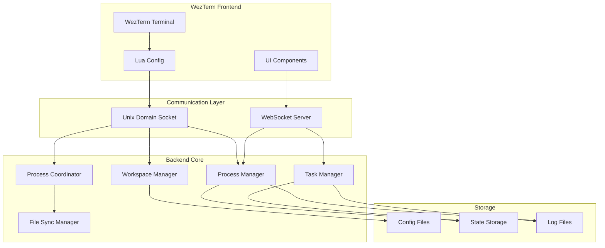

# データフロー設計書

## 概要

WezTermマルチプロセス開発補助ツールにおけるデータの流れを定義します。

## 1. システム全体のデータフロー



## 2. プロセス協調データフロー (Issue #17)

### 2.1 タスク分散フロー

```
1. ユーザー → タスク投入
2. TaskManager → タスクキューに追加
3. TaskDistributor → 依存関係解析
4. ProcessCoordinator → 負荷分散計算
5. ProcessCoordinator → 最適プロセスに割り当て
6. TargetProcess → タスク実行
7. TargetProcess → 結果返却
8. MergeManager → 結果統合
9. ユーザー → 統合結果受信
```

### 2.2 ファイル同期フロー

```
1. Process A → ファイル変更
2. FileSyncManager → 変更検知
3. FileSyncManager → 他プロセスに通知
4. Process B,C → 変更受信
5. MergeManager → 競合チェック
6. MergeManager → 自動マージ or 競合通知
7. 全プロセス → 同期状態
```

## 3. テンプレート適用フロー (Issue #18)

### 3.1 テンプレート読み込み

```
1. ユーザー → テンプレート選択
2. template_loader.lua → YAMLパース
3. template_loader.lua → バリデーション
4. layout_engine.lua → レイアウト計算
5. pane_manager.lua → ペイン作成
6. pane_manager.lua → コマンド実行
```

### 3.2 レイアウト保存

```
1. ユーザー → 保存コマンド
2. pane_manager.lua → 現在のレイアウト取得
3. template_manager.lua → YAML生成
4. template_manager.lua → ファイル保存
5. template_manager.lua → 履歴更新
```

## 4. メトリクスデータフロー

### 4.1 収集フロー

```
1. MetricsCollector → システムメトリクス収集 (1秒間隔)
2. ProcessMonitor → プロセスメトリクス収集
3. TaskTracker → タスクメトリクス収集
4. MetricsAggregator → データ集約
5. MetricsStorage → 時系列保存
```

### 4.2 配信フロー

```
1. WebSocketServer → クライアント接続受付
2. DashboardManager → 購読管理
3. MetricsAggregator → リアルタイムデータ
4. WebSocketServer → JSON配信
5. ブラウザ → グラフ表示更新
```

## 5. 状態管理フロー

### 5.1 Room状態

```yaml
# ~/.wezterm-parallel/rooms/project-name/state.yaml
room:
  name: project-name
  created_at: 2025-06-27T10:00:00Z
  template: claude-dev
  active: true
  
processes:
  - id: claude-main
    pid: 12345
    status: running
    started_at: 2025-06-27T10:00:01Z
    
panes:
  - id: main-editor
    process: claude-main
    position: {row: 0, col: 0, width: 0.6, height: 1.0}
```

### 5.2 タスク状態

```yaml
# ~/.wezterm-parallel/tasks/current.yaml
tasks:
  - id: task-123
    status: in_progress
    assigned_to: process-1
    started_at: 2025-06-27T10:00:00Z
    dependencies: []
    
  - id: task-124
    status: queued
    priority: high
    estimated_duration: 300
```

## 6. エラーハンドリングフロー

### 6.1 プロセス障害

```
1. ProcessMonitor → プロセス異常検知
2. ProcessCoordinator → タスク再割り当て判定
3. TaskDistributor → 他プロセスに再割り当て
4. AlertManager → ユーザー通知
5. ProcessManager → 自動再起動試行
```

### 6.2 同期競合

```
1. FileSyncManager → 競合検知
2. MergeManager → 自動マージ試行
3. 失敗時 → バックアップ作成
4. ConflictResolver → 手動解決UI表示
5. ユーザー → 解決方法選択
```

## 7. セキュリティデータフロー

### 7.1 アクセス制御

```
1. クライアント → 接続要求
2. Unix Socket → ファイル権限チェック
3. SessionManager → セッション作成
4. 全リクエスト → セッション検証
5. プロセス → Room境界内で動作
```

### 7.2 ログ記録

```
1. 全操作 → 構造化ログ生成
2. LogManager → ログレベルフィルタ
3. LogRotator → ファイルローテーション
4. LogAnalyzer → 異常パターン検知
```

## 8. パフォーマンス最適化

### 8.1 キャッシング

- テンプレート: 5分間メモリキャッシュ
- メトリクス: 1分間の集計値保持
- プロセス状態: 1秒間隔で更新

### 8.2 バッチ処理

- ファイル同期: 100ms待機後バッチ送信
- メトリクス配信: 1秒間隔でバッチ配信
- ログ書き込み: 1秒または100件でフラッシュ