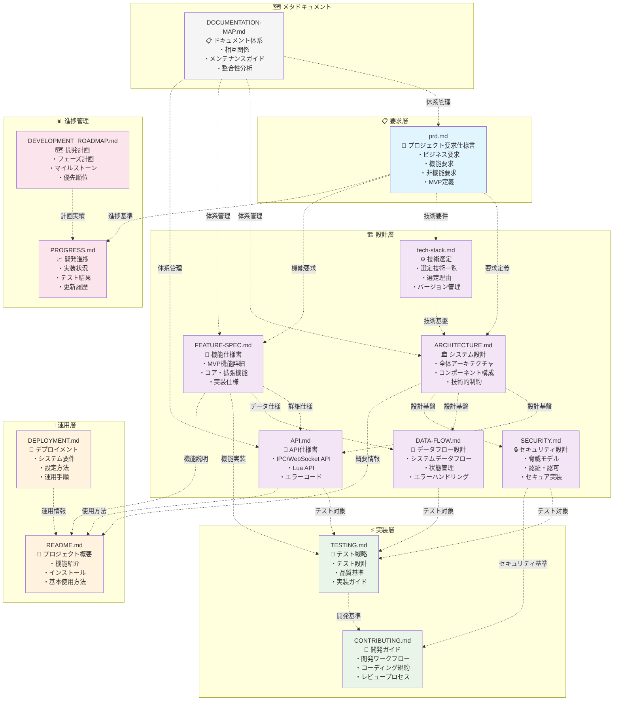
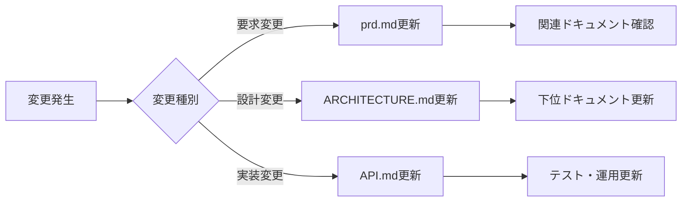

# ドキュメント体系マップ

## 概要

WezTermマルチプロセス開発補助ツールのドキュメント体系を可視化し、各ドキュメントの役割と相互関係を明確にします。

## ドキュメント関係図



## 各ドキュメントの内容と責務

### 1. 要求層

#### **prd.md** (プロジェクト要求仕様書)
- **目的**: ビジネス要求と機能要求の定義
- **内容**:
  - プロダクト概要（目的、スコープ）
  - 機能要求（コア機能、UI/UX、設定）
  - 非機能要求（性能、可用性、保守性、セキュリティ）
  - ユーザーストーリー
  - 受け入れ基準
  - MVP実装状況
- **参照元**: なし（最上位）
- **参照先**: ARCHITECTURE.md, tech-stack.md, PROGRESS.md

### 2. 設計層

#### **ARCHITECTURE.md** (アーキテクチャ仕様書)
- **目的**: システムの全体構造と設計思想
- **内容**:
  - システム全体アーキテクチャ図
  - コンポーネント構成
  - レイヤー設計
  - データフロー概要
  - 技術的制約
- **参照元**: prd.md, tech-stack.md
- **参照先**: API.md, DATA-FLOW.md, SECURITY.md

#### **tech-stack.md** (技術スタック)
- **目的**: 技術選定の理由と詳細
- **内容**:
  - 選定技術一覧（Rust, Lua, WebSocket等）
  - 選定理由
  - バージョン情報
  - 依存関係
- **参照元**: prd.md
- **参照先**: ARCHITECTURE.md

#### **FEATURE-SPEC.md** (機能仕様書)
- **目的**: 詳細な機能仕様の定義
- **内容**:
  - MVP機能の詳細仕様（Issue #17, #18）
  - コア機能・拡張機能の仕様
  - 入出力・制約・実装状況
  - 非機能要求・セキュリティ要件
  - テスト仕様・運用仕様
- **参照元**: prd.md, ARCHITECTURE.md
- **参照先**: API.md, DATA-FLOW.md, TESTING.md

#### **API.md** (API仕様書)
- **目的**: 外部インターフェースの詳細定義
- **内容**:
  - IPC API (Unix Domain Socket)
  - WebSocket API
  - Lua API
  - メッセージフォーマット
  - エラーコード
- **参照元**: ARCHITECTURE.md
- **参照先**: TESTING.md, README.md

#### **DATA-FLOW.md** (データフロー設計書)
- **目的**: データの流れと状態管理の詳細
- **内容**:
  - システム全体のデータフロー
  - プロセス協調フロー
  - テンプレート適用フロー
  - 状態管理
  - エラーハンドリングフロー
- **参照元**: ARCHITECTURE.md
- **参照先**: TESTING.md

#### **SECURITY.md** (セキュリティ設計書)
- **目的**: セキュリティ要件の実装方法
- **内容**:
  - セキュリティ原則
  - 脅威モデル
  - 認証・認可
  - 入力検証
  - 監査・ログ
- **参照元**: prd.md (セキュリティ要求), ARCHITECTURE.md
- **参照先**: TESTING.md, CONTRIBUTING.md

### 3. 実装層

#### **TESTING.md** (テスト戦略・設計書)
- **目的**: 品質保証の方法論
- **内容**:
  - テスト戦略（ピラミッド）
  - テスト実装ガイド
  - MVP機能のテスト
  - パフォーマンステスト
  - テスト実行方法
- **参照元**: API.md, DATA-FLOW.md, SECURITY.md
- **参照先**: CONTRIBUTING.md

#### **CONTRIBUTING.md** (コントリビューションガイド)
- **目的**: 開発者向けの貢献方法
- **内容**:
  - 開発環境セットアップ
  - コーディング規約
  - テスト作成
  - レビュープロセス
  - コミュニティガイドライン
- **参照元**: TESTING.md, SECURITY.md
- **参照先**: なし

### 4. 運用層

#### **README.md** (プロジェクト概要)
- **目的**: ユーザー向けの導入ガイド
- **内容**:
  - プロジェクト概要
  - MVP機能 (Issue #17, #18)
  - インストール方法
  - 基本的な使い方
  - システム情報
- **参照元**: ARCHITECTURE.md, API.md
- **参照先**: DEPLOYMENT.md

#### **DEPLOYMENT.md** (デプロイメントガイド)
- **目的**: 詳細な導入・運用手順
- **内容**:
  - システム要件
  - インストール手順
  - 初期設定
  - トラブルシューティング
  - アップデート方法
- **参照元**: README.md
- **参照先**: なし

### 5. 進捗管理

#### **PROGRESS.md** (開発進捗レポート)
- **目的**: 現在の開発状況の記録
- **内容**:
  - フェーズ進捗
  - 完了タスク
  - テスト結果
  - 更新ログ
- **参照元**: prd.md, DEVELOPMENT_ROADMAP.md
- **参照先**: なし

#### **DEVELOPMENT_ROADMAP.md** (開発ロードマップ)
- **目的**: 将来の開発計画
- **内容**:
  - フェーズ計画
  - マイルストーン
  - 優先順位
- **参照元**: prd.md
- **参照先**: PROGRESS.md

## 重複と矛盾の分析（2025-06-27更新）

### 1. 重複箇所（解決済み）

#### **MVP機能の記載**
- **状況**: README.md, prd.md, PROGRESS.mdで統一済み
- **実装**: Issue #17（協調システム）, Issue #18（テンプレート）として一貫

#### **実装規模**
- **修正前**: 各ドキュメントで57,574-60,000行と記載
- **修正後**: 実測値（Rust: 19,335行, Lua: 7,175行, 合計26,500行）に統一

#### **テスト状況**
- **修正前**: 108個-127個-136個の不整合
- **修正後**: 127個のライブラリテスト（通過）、統合テスト（8通過/4失敗）に統一

### 2. 解決済みの矛盾

#### **スコープの不一致**
- **対策完了**: PRDに注記追加（MVP vs 理想要求の分離）
- **状況**: 個人利用専用ツールとして統一

#### **テスト成功率の虚偽記載**
- **問題**: 「全テスト通過」と記載、実際は統合テスト一部失敗
- **対策**: 正確な状況（ライブラリテスト127個通過、統合テスト部分実装中）に修正

### 3. 解決済みの欠落情報

#### **機能仕様書**
- **問題**: 機能仕様がprd.md、API.md、README.mdに散在
- **解決**: FEATURE-SPEC.md作成により一元化
- **内容**: MVP機能の詳細仕様、コア・拡張機能、非機能要求を網羅

#### **エラーコード一覧**
- **現状**: API.mdに基本定義あり
- **推奨**: エラーハンドリングガイドの追加

#### **設定ファイルリファレンス**
- **現状**: DEPLOYMENT.mdに例あり
- **推奨**: 完全な設定リファレンスの作成

## 改善提案

### 1. 重複削減

```yaml
# ドキュメント間の参照ルール
primary_source:
  mvp_definition: prd.md
  test_count: TESTING.md
  system_requirements: DEPLOYMENT.md
  api_spec: API.md

reference_only:
  - README.md  # 要約のみ記載
  - PROGRESS.md  # 現状のスナップショット
```

### 2. 整合性チェック

定期的に以下を確認：
1. PRDの要求がARCHITECTUREに反映されているか
2. ARCHITECTUREの設計がAPIに実装されているか
3. APIの仕様がTESTINGでカバーされているか
4. SECURITYの要件がコードに実装されているか

### 3. ドキュメント更新ルール



## 結論

現在のドキュメント体系は概ね適切に構成されていますが、以下の点に注意が必要です：

1. **MVP機能の記載統一**: 各ドキュメントでの記載レベルを明確化
2. **テスト数の一元管理**: TESTING.mdを正として他は参照
3. **個人利用の明確化**: 全ドキュメントで統一した表現

これらの改善により、ドキュメント間の整合性と保守性が向上します。

## 開発者向けドキュメントメンテナンスガイド

### 📋 基本原則

#### 1. Single Source of Truth (信頼できる唯一の情報源)
各情報は1つのドキュメントで管理し、他は参照のみ：

```yaml
主要情報の管理責任:
  MVP定義: FEATURE-SPEC.md
  テスト数: TESTING.md
  実装規模: PROGRESS.md
  システム要件: DEPLOYMENT.md
  API仕様: API.md
```

#### 2. 更新の伝播ルール
情報を更新する際は、参照先も確認・更新：


#### 3. 定期的な整合性チェック
月1回、以下を確認：
- [ ] テスト数の一致
- [ ] 実装規模の正確性
- [ ] MVP機能の記載統一
- [ ] リンク切れの確認

### 🔄 ドキュメント更新ワークフロー

#### 機能追加時のドキュメント更新手順

1. **要求変更時**
   ```bash
   # 更新順序
   1. prd.md          # 要求定義更新
   2. FEATURE-SPEC.md # 機能仕様詳細化
   3. API.md          # インターフェース定義
   4. TESTING.md      # テスト要件追加
   5. README.md       # ユーザー向け説明更新
   ```

2. **実装完了時**
   ```bash
   # 更新順序
   1. FEATURE-SPEC.md # 実装状況更新 (❌→✅)
   2. TESTING.md      # テスト結果更新
   3. PROGRESS.md     # 進捗状況更新
   4. README.md       # 機能紹介更新
   ```

3. **バグ修正時**
   ```bash
   # 更新順序
   1. FEATURE-SPEC.md # 制約・仕様の明確化
   2. TESTING.md      # テストケース追加
   3. PROGRESS.md     # 修正履歴記録
   ```

#### コミットメッセージルール

ドキュメント更新時は以下の形式を使用：

```
📝 Update <ドキュメント名> - <変更概要>

- 具体的な変更内容1
- 具体的な変更内容2

Affected docs: <影響を受ける他のドキュメント>
```

**例**:
```
📝 Update FEATURE-SPEC.md - Add Issue #20 file watcher specification

- Add FileWatcher component detailed specification
- Update implementation status for MVP features
- Add performance requirements for file monitoring

Affected docs: API.md, TESTING.md, PROGRESS.md
```

### 📊 品質管理チェックリスト

#### 新機能追加時
- [ ] FEATURE-SPEC.mdに機能ID付きで仕様を追加
- [ ] API.mdにインターフェース仕様を追加
- [ ] TESTING.mdにテスト要件を追加
- [ ] 実装完了後にPROGRESS.mdを更新
- [ ] ユーザー向け機能はREADME.mdに反映

#### ドキュメント品質チェック
- [ ] 全てのリンクが正常に動作する
- [ ] コードブロックの構文が正しい
- [ ] 数値データ（テスト数、行数等）が最新
- [ ] 英数字・記号の使い方が統一されている
- [ ] 敬語・表現レベルが統一されている

#### 月次メンテナンス
- [ ] 実装規模の再測定・更新
- [ ] テスト結果の正確性確認
- [ ] リンク切れの確認・修正
- [ ] 廃止予定機能のマーク更新
- [ ] 新機能の実装状況更新

### ⚡ 効率的なメンテナンス方法

#### 1. 自動化ツールの活用

```bash
# 実装規模の自動測定
echo "Rust: $(find . -name "*.rs" -not -path "./target/*" | xargs wc -l | tail -1 | awk '{print $1}') lines"
echo "Lua: $(find . -name "*.lua" | xargs wc -l | tail -1 | awk '{print $1}') lines"

# テスト結果の取得
cargo test 2>&1 | grep "test result:"

# リンク切れチェック（将来実装）
# markdown-link-check docs/*.md
```

#### 2. テンプレート活用

**新機能仕様テンプレート**:
```yaml
## X.X <機能名> (Issue #XX)

**機能ID**: <ID>
**概要**: <1行説明>

**詳細仕様**:
入力: <データ形式>
処理: <処理内容>
出力: <結果形式>
制約: <制限事項>

**実装状況**: ❌ 未実装 / ⏳ 実装中 / ✅ 完了
```

#### 3. 変更影響範囲の把握

```yaml
変更タイプ別影響範囲:
  MVP機能変更:
    影響: prd.md, FEATURE-SPEC.md, API.md, README.md, PROGRESS.md
    
  API変更:
    影響: API.md, FEATURE-SPEC.md, TESTING.md, README.md
    
  テスト変更:
    影響: TESTING.md, PROGRESS.md, README.md
    
  設定変更:
    影響: DEPLOYMENT.md, README.md, FEATURE-SPEC.md
```

### 🚨 注意事項

#### 必須ルール
1. **数値データは測定ベース**: 推測で更新しない
2. **実装状況は正確に**: 過大評価・虚偽記載禁止
3. **参照整合性維持**: 関連ドキュメントも同時更新
4. **用語統一**: 専門用語は全ドキュメントで統一

#### 禁止事項
- ❌ 未確認情報の記載
- ❌ 他ドキュメントとの矛盾放置
- ❌ リンク切れの放置
- ❌ テスト結果の改ざん

### 📞 質問・相談

ドキュメントメンテナンスで不明な点があれば：

1. **GitHub Issues**: ドキュメント改善提案
2. **GitHub Discussions**: メンテナンス方法の議論
3. **Pull Request**: 具体的な修正提案

このガイドに従って、高品質で整合性のあるドキュメント体系を維持してください。