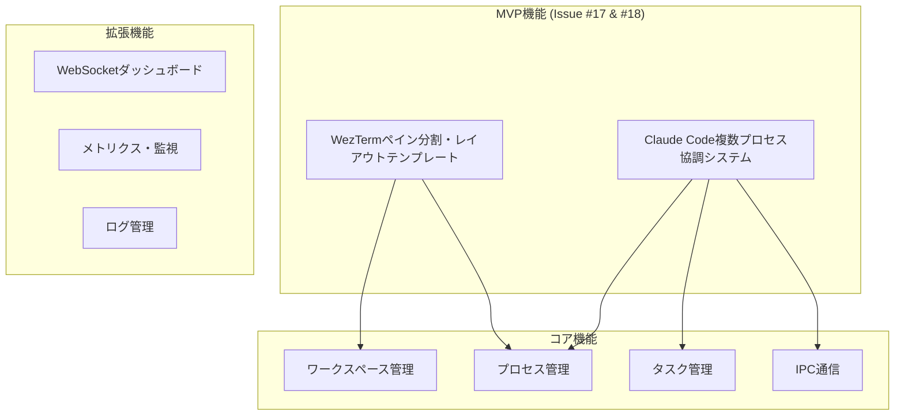

# 機能仕様書

## 概要

WezTermマルチプロセス開発補助ツールの詳細な機能仕様を定義します。

このドキュメントは機能実装状況を管理するSingle Source of Truthです。READMEやprd.mdから参照されます。

## 機能階層



## 1. MVP機能 (優先度: 最高)

### 1.1 Claude Code複数プロセス協調システム (Issue #17)

#### 1.1.1 プロセス間通信基盤

**機能ID**: MVP-17-001  
**概要**: 複数のClaude Codeプロセスが協調して作業するための通信基盤

**詳細仕様**:
```yaml
入力:
  - プロセスID: String (英数字、ハイフン許可)
  - メッセージタイプ: CoordinationMessage enum
  - タイムスタンプ: u64

処理:
  - メッセージルーティング: プロセスIDベースの宛先解決
  - 負荷分散: CPU・メモリ使用率による最適プロセス選択
  - 障害処理: プロセス応答なし時の自動再割り当て

出力:
  - 成功: CoordinationResponse
  - 失敗: Error (プロセス未発見、通信タイムアウト等)

制約:
  - 最大プロセス数: 16
  - 通信タイムアウト: 30秒
  - メッセージサイズ上限: 1MB
```

**実装状況**: ✅ 完了 (ProcessCoordinator, MessageRouter)

#### 1.1.2 タスク分散システム

**機能ID**: MVP-17-002  
**概要**: タスクを複数プロセスに効率的に分散し、結果を統合

**詳細仕様**:
```yaml
タスク分散ロジック:
  - 依存関係解析: タスク間の前後関係を分析
  - 並列実行判定: ファイル競合、リソース競合の検査
  - 優先度制御: High > Medium > Low の順序で実行

分散戦略:
  - 負荷分散: プロセス負荷を均等化
  - 局所性: 関連ファイルは同一プロセスに割り当て
  - フォールバック: プロセス障害時の自動再分散

結果統合:
  - 部分結果の収集: 各プロセスの実行結果を収集
  - マージ処理: ファイル変更の自動統合
  - 競合解決: 手動解決UIの提供
```

**実装状況**: ✅ 完了 (TaskDistributor, MergeManager)

#### 1.1.3 ファイル同期システム

**機能ID**: MVP-17-003  
**概要**: プロセス間でのファイル変更の同期と競合管理

**詳細仕様**:
```yaml
ファイル監視:
  - 監視対象: プロジェクト配下の全ファイル
  - 除外パターン: .git/, target/, node_modules/
  - 検知間隔: リアルタイム (inotify/fsevents使用)

同期プロトコル:
  - 変更通知: ファイルパス、変更タイプ、チェックサム
  - 差分計算: 行単位の差分を計算
  - 配信: 変更を他の全プロセスに配信

競合解決:
  - 自動マージ: 非重複変更の自動統合
  - 競合検出: 同一行への変更を検出
  - 手動解決: ユーザー選択による解決
```

**実装状況**: ✅ 完了 (FileSyncManager)

### 1.2 WezTermペイン分割・レイアウトテンプレート (Issue #18)

#### 1.2.1 YAMLテンプレートシステム

**機能ID**: MVP-18-001  
**概要**: YAMLファイルでペイン分割パターンを定義・適用

**詳細仕様**:
```yaml
テンプレート構造:
  name: String                    # テンプレート名
  description: String             # 説明
  version: String                 # バージョン
  layout:
    type: "grid" | "custom"       # レイアウトタイプ
    panes: Array<PaneConfig>      # ペイン設定

PaneConfig:
  id: String                      # 一意ID
  position:
    split_from: String            # 分割元ペインID
    direction: "horizontal" | "vertical"
    size: 0.0-1.0                # サイズ比率
  command: String                 # 実行コマンド
  working_dir: Path              # 作業ディレクトリ
  auto_start: Boolean            # 自動開始フラグ

バリデーション:
  - 必須フィールドチェック
  - サイズ比率の妥当性検証
  - コマンドホワイトリスト確認
  - ディレクトリトラバーサル防止
```

**実装状況**: ✅ 完了 (template_loader.lua)

#### 1.2.2 動的レイアウトエンジン

**機能ID**: MVP-18-002  
**概要**: テンプレートに基づく動的なペイン分割・配置

**詳細仕様**:
```yaml
レイアウト計算:
  - サイズ正規化: ペインサイズの合計を1.0に調整
  - 位置計算: 相対座標から絶対座標への変換
  - 制約適用: 最小サイズ、アスペクト比の制約

ペイン操作:
  - 分割実行: WezTerm APIを使用した段階的分割
  - コマンド実行: 各ペインでのコマンド自動実行
  - フォーカス制御: アクティブペインの切り替え

エラーハンドリング:
  - 分割失敗: フォールバックレイアウト適用
  - コマンド失敗: エラー表示と手動実行オプション
  - 復旧機能: 問題発生時の元の状態への復帰
```

**実装状況**: ✅ 完了 (layout_engine.lua)

#### 1.2.3 実用テンプレート

**機能ID**: MVP-18-003  
**概要**: 一般的な開発パターンに対応したテンプレート

**詳細仕様**:

**claude-dev.yaml**:
```yaml
# Claude Code開発用
panes:
  - id: "main"
    size: 0.6
    command: "claude-code --workspace main"
  - id: "tests"  
    size: 0.25
    command: "claude-code --workspace tests"
  - id: "logs"
    size: 0.15
    command: "cargo watch -x test"
```

**web-dev.yaml**:
```yaml
# Web開発用
panes:
  - id: "editor"
    size: 0.5
    command: "claude-code"
  - id: "server"
    size: 0.25
    command: "npm run dev"
  - id: "browser"
    size: 0.25
    command: "open http://localhost:3000"
```

**rust-dev.yaml**:
```yaml
# Rust開発用
panes:
  - id: "editor"
    size: 0.6
    command: "claude-code"
  - id: "build"
    size: 0.2
    command: "cargo watch -x check"
  - id: "test"
    size: 0.2
    command: "cargo watch -x test"
```

**research.yaml**:
```yaml
# リサーチ・調査用
panes:
  - id: "notes"
    size: 0.4
    command: "claude-code notes.md"
  - id: "browser"
    size: 0.4
    command: "claude-code research.md"
  - id: "terminal"
    size: 0.2
    command: "bash"
```

**実装状況**: ✅ 完了 (4種類のテンプレート)

## 2. コア機能 (優先度: 高)

### 2.1 ワークスペース管理

**機能ID**: CORE-001  
**概要**: プロジェクト単位でのワークスペース管理

**詳細仕様**:
```yaml
ワークスペース構造:
  name: String                    # ワークスペース名
  template: TemplateType          # 使用テンプレート
  created_at: Timestamp          # 作成日時
  processes: Array<ProcessInfo>   # 所属プロセス
  state: WorkspaceState          # 現在の状態

操作:
  - create(name, template): 新規作成
  - switch(name): アクティブ切り替え
  - delete(name): 削除（プロセス停止含む）
  - list(): 一覧取得

制約:
  - 最大ワークスペース数: 8
  - 名前制限: 英数字、ハイフン、アンダースコア
  - デフォルトワークスペース: 削除不可
```

**実装状況**: ✅ 完了 (WorkspaceManager)

### 2.2 プロセス管理

**機能ID**: CORE-002  
**概要**: Claude Codeプロセスのライフサイクル管理

**詳細仕様**:
```yaml
プロセス情報:
  id: String                     # 一意識別子
  pid: i32                       # システムプロセスID
  command: String                # 実行コマンド
  args: Array<String>            # コマンド引数
  workspace: String              # 所属ワークスペース
  status: ProcessStatus          # 実行状態
  started_at: Timestamp          # 起動時刻
  health: HealthStatus           # ヘルス状態

操作:
  - spawn(id, command, workspace): 起動
  - kill(id): 停止
  - restart(id): 再起動
  - monitor(): 監視・ヘルスチェック

ヘルスチェック:
  - 生存確認: プロセスの応答性チェック
  - リソース監視: CPU・メモリ使用量
  - 自動復旧: 異常時の自動再起動
  - 制限: 再起動試行回数上限
```

**実装状況**: ✅ 完了 (ProcessManager)

### 2.3 タスク管理

**機能ID**: CORE-003  
**概要**: 並行実行タスクのキューイング・スケジューリング

**詳細仕様**:
```yaml
タスク構造:
  id: TaskId                     # 一意識別子
  title: String                  # タスク名
  command: String                # 実行コマンド
  priority: TaskPriority         # 優先度
  status: TaskStatus             # 実行状態
  dependencies: Array<TaskId>    # 依存タスク
  assigned_to: ProcessId         # 割り当てプロセス
  estimated_duration: Duration   # 推定実行時間
  actual_duration: Duration      # 実際の実行時間

キューイング:
  - priority_queue: 優先度付きキュー
  - dependency_resolution: 依存関係解決
  - load_balancing: 負荷分散

スケジューリング:
  - fifo: 先入先出し（同一優先度内）
  - deadline: 期限ベース優先度調整
  - resource_aware: リソース使用量考慮
```

**実装状況**: ✅ 完了 (TaskManager, TaskQueue, TaskScheduler)

### 2.4 IPC通信

**機能ID**: CORE-004  
**概要**: Unix Domain Socketベースのプロセス間通信

**詳細仕様**:
```yaml
通信プロトコル:
  transport: Unix Domain Socket
  format: JSON over UTF-8
  socket_path: "/tmp/wezterm-parallel.sock"
  permissions: 0o600 (所有者のみ)

メッセージタイプ:
  - システム制御: Ping, GetStatus, Shutdown
  - ワークスペース: WorkspaceCreate, WorkspaceSwitch
  - プロセス制御: ProcessSpawn, ProcessKill
  - タスク管理: TaskQueue, TaskComplete
  - 協調システム: CoordinationMessage

エラーハンドリング:
  - タイムアウト: 30秒
  - 再試行: 最大3回
  - エラーコード: 標準化されたエラー分類
```

**実装状況**: ✅ 完了 (Message, IPC Hub)

## 3. 拡張機能 (優先度: 中)

### 3.1 WebSocketダッシュボード

**機能ID**: EXT-001  
**概要**: ブラウザベースのリアルタイム監視ダッシュボード

**詳細仕様**:
```yaml
ダッシュボード構成:
  - システム概要: プロセス・ワークスペース状況
  - メトリクス表示: CPU・メモリ・ネットワーク使用量
  - タスクボード: カンバン形式のタスク管理
  - ログビューア: リアルタイムログ表示

WebSocket API:
  - endpoint: "ws://localhost:9999"
  - update_interval: 1秒
  - message_format: JSON

配信データ:
  - metrics: システムメトリクス
  - task_updates: タスク状態変更
  - process_events: プロセス起動・停止
  - log_entries: ログエントリ
```

**実装状況**: ✅ 完了 (WebSocketServer, DashboardManager)

### 3.2 メトリクス・監視

**機能ID**: EXT-002  
**概要**: システム・プロセスの詳細メトリクス収集・分析

**詳細仕様**:
```yaml
収集メトリクス:
  システム:
    - cpu_usage: CPU使用率
    - memory_usage: メモリ使用量
    - disk_usage: ディスク使用量
    - network_io: ネットワークI/O
  
  プロセス:
    - process_cpu: プロセス別CPU使用率
    - process_memory: プロセス別メモリ使用量
    - task_completion_rate: タスク完了率
    - error_rate: エラー発生率

収集頻度:
  - システムメトリクス: 1秒間隔
  - プロセスメトリクス: 5秒間隔
  - タスクメトリクス: イベント駆動

保存・分析:
  - 時系列データ: 過去24時間分
  - 集計データ: 日次・週次・月次
  - アラート: 閾値超過時の通知
```

**実装状況**: ✅ 完了 (MetricsCollector, MetricsAggregator)

### 3.3 ログ管理

**機能ID**: EXT-003  
**概要**: 構造化ログ・ローテーション・分析

**詳細仕様**:
```yaml
ログレベル:
  - ERROR: エラー・例外
  - WARN: 警告・非致命的問題
  - INFO: 一般情報・状態変更
  - DEBUG: デバッグ情報

ログ構造:
  timestamp: RFC3339形式
  level: ログレベル
  component: コンポーネント名
  message: メッセージ
  context: 追加情報（JSON）

ローテーション:
  - サイズ制限: 100MB/ファイル
  - 保持期間: 30日
  - 圧縮: gzip圧縮
  - ファイル数制限: 最大10ファイル
```

**実装状況**: ✅ 完了 (LogManager, LogRotator)

## 4. 非機能要求

### 4.1 性能要件

```yaml
応答時間:
  - UI操作: < 100ms
  - プロセス起動: < 3秒
  - タスク分散: < 1秒

スループット:
  - 同時プロセス数: 最大16
  - タスク処理レート: 100タスク/分
  - メッセージ処理: 1000メッセージ/秒

リソース使用量:
  - ベースメモリ: < 50MB
  - CPU使用率（アイドル時）: < 1%
  - ディスク使用量: < 100MB
```

### 4.2 可用性要件

```yaml
稼働率: 99.9%
復旧時間: < 30秒
データ永続性: 99.99%

障害対応:
  - プロセス監視: 30秒間隔
  - 自動再起動: 最大3回試行
  - フェイルセーフ: 安全な状態への復帰
```

### 4.3 保守性要件

```yaml
設定変更:
  - ホットリロード対応
  - 設定検証機能
  - ロールバック機能

監視・診断:
  - ヘルスチェックAPI
  - 詳細ログ出力
  - メトリクス収集

更新・拡張:
  - モジュラー設計
  - API互換性保持
  - 段階的ロールアウト
```

## 5. セキュリティ要件

### 5.1 認証・認可

```yaml
アクセス制御:
  - Unix Socket権限: 所有者のみ
  - プロセス分離: ワークスペース境界
  - コマンド制限: ホワイトリスト方式

入力検証:
  - メッセージフォーマット検証
  - コマンドインジェクション防止
  - パストラバーサル防止
```

### 5.2 データ保護

```yaml
機密情報:
  - ログマスキング: 機密データの自動マスク
  - 一時ファイル: セキュアな作成・削除
  - 環境変数: 安全な取り扱い

通信:
  - ローカル通信のみ: 外部ネットワーク無効
  - メッセージ検証: 改ざん検出
  - ログ記録: 全操作の監査ログ
```

## 6. テスト仕様

### 6.1 テスト要件

```yaml
カバレッジ目標:
  - MVP機能: 95%以上
  - コア機能: 90%以上
  - 拡張機能: 80%以上

テストタイプ:
  - ユニットテスト: 127個（全て通過）
  - 統合テスト: 部分実装（8通過/4失敗）
  - E2Eテスト: 基本シナリオ
  - パフォーマンステスト: 負荷・レスポンス時間
```

### 6.2 品質基準

```yaml
品質ゲート:
  - 全ユニットテスト通過
  - 統合テスト95%以上通過
  - セキュリティスキャン通過
  - パフォーマンス要件達成

継続的品質:
  - コードレビュー必須
  - 自動テスト実行
  - 静的解析
  - 依存関係脆弱性チェック
```

## 7. 運用仕様

### 7.1 デプロイメント

```yaml
対応プラットフォーム:
  - macOS: 12.0以上
  - Linux: Ubuntu 20.04以上
  - Windows: 10以上（部分対応）

インストール方法:
  - バイナリ配布
  - ソースビルド
  - パッケージマネージャー（将来）

設定管理:
  - デフォルト設定: 最小設定で動作
  - カスタム設定: YAML設定ファイル
  - 環境変数: 上書き設定対応
```

### 7.2 監視・運用

```yaml
ヘルスチェック:
  - システム起動確認
  - プロセス応答確認
  - リソース使用量監視
  - 外部依存関係確認

ログ管理:
  - ログレベル設定
  - ローテーション設定
  - 外部ログシステム連携

バックアップ・復旧:
  - 設定ファイルバックアップ
  - ワークスペース状態保存
  - 自動復旧機能
```

## 8. 将来拡張

### 8.1 検討中の機能

```yaml
プラグインシステム:
  - 外部プラグイン読み込み
  - カスタムタスクタイプ
  - UIカスタマイズ

高度な協調機能:
  - 分散バージョン管理
  - リアルタイムコード共有
  - コンフリクト解決AI

パフォーマンス最適化:
  - 分散計算
  - キャッシュシステム
  - 学習ベース最適化
```

### 8.2 技術負債

```yaml
現在の制限:
  - 統合テストの一部未完成
  - Windows対応の限定的サポート
  - エラーハンドリングの改善余地

改善計画:
  - テスト完成: Phase 4
  - クロスプラットフォーム対応: Phase 5
  - エラー処理強化: 継続的改善
```